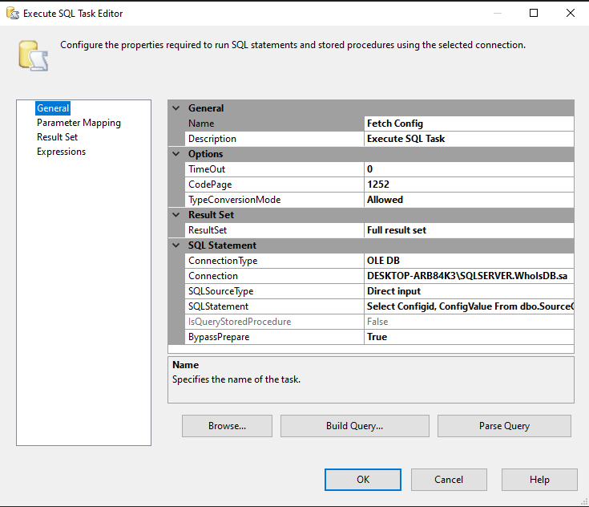

# ETL - WITH SSIS

## Description:
This project aims to perform ETL and ELT using SQL Server and SSIS. The data and domain used are obtained from the Domain WhoIs database by extracting a few sample data. The applications used for this project are SQL Server 2022 and Visual Studio Code 2022. The data is retrieved from the following domain: http://domainwhoisdatabase.com/whois_database/sample/gtlds/v44/sample/simple/

## Objectives:

1. Establish a connection from the domain to the local environment.
2. Download the file from the domain to the local environment.
3.  Create a task to unzip the downloaded file.
4. Establish a connection from the local environment to the OLE DB.
5. Archive the downloaded file.
6. Send email notifications.

## Procedure
### 1. Create a Source Configuration table in a Database.

#### A. Create New DataBase (WhoIsDB)

#### B. Create New Configuration Table (dbo.SourceConfig)

### 2. Create SSIS Package design to Read and Map source configuration data to a Variabel

#### A. Create connection to Local DB SQL SERVER

#### B. Create New Variable (ConfigObject)

#### C. Create Project Parameter (URLSource)

### 3. Download files from Source URL
#### A. Create and Setting up Foreach Loop Container

#### B. Create FileConnection Variable dengan expression URLSource dan Configvalue

#### C. Create ConfigValue dengan value file yang akan di download

#### D. Make New Domain Connection (HTTP Connection Manager)

#### E. Create new Variable for destination (TargetFolderConnection)

### 4. Create Script Task (Download Source Zipfile)

Create Script 

### 5. Create Execute Procces Task (Unzip Source File)

### 6. Create Data Flow Task
#### A. Create Source connection (Flat File Source)

#### B. Create OLE DB connection (OLE DB Destination)

Checking Mapping Table

Create Variabel for dynamic

### 7. Create Achive system
#### A. Create File System Task (Create Folder Archive if Not Exist)
##### a. Make Variable ArchiveFolderPath
#### B. Create File System Task (Move csv file To Archive Folder)
#### B. Create File System Task (Move zip file To Archive Folder)
